# Project Name - Note-Taker

# Project URL

https://github.com/TessyJ/Note-Taker

# Project Repository

https://tessyj.github.io/Note-Taker/

# Heroku Repository
https://dashboard.heroku.com/apps

# Project Description

The application Note-Taker is used to write, save, and delete notes.
When entering a new note title and text, a Save icon appears in the navigation at the top of the page in the left-hand column with the other existing notes.

When I click on an existing note in the list in the left-hand column, that note appears in the right-hand column and also, when I delete the note, it removes from the page.
The images from the page from shots 9- 11 show the delete page.

# Screen Shot

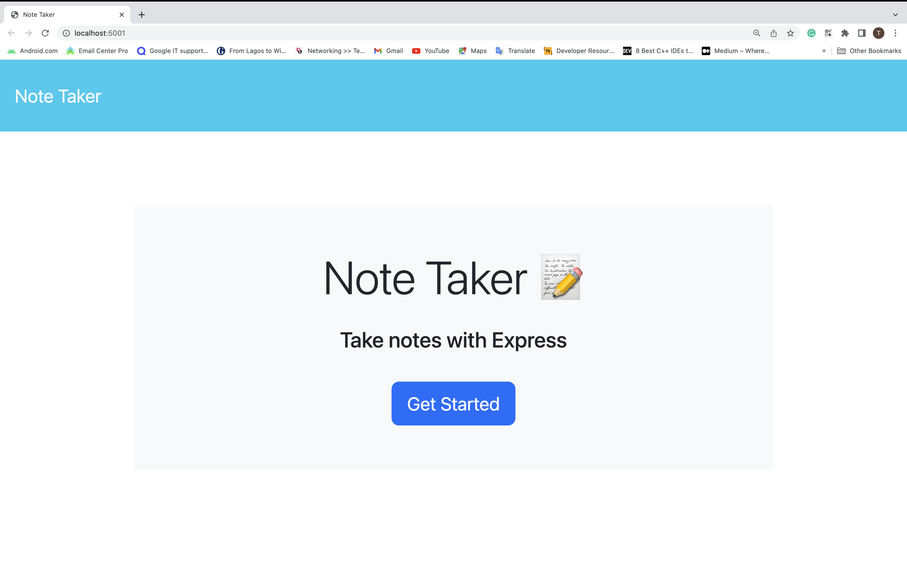
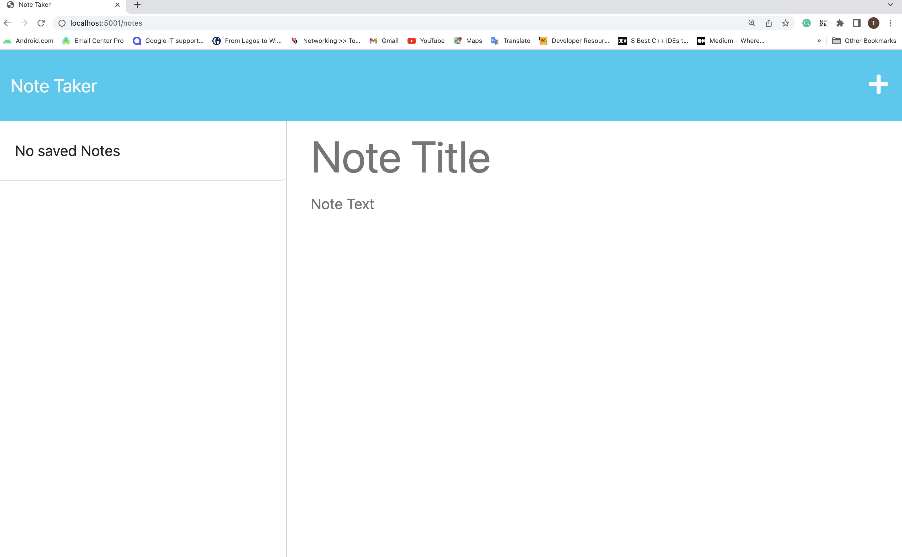
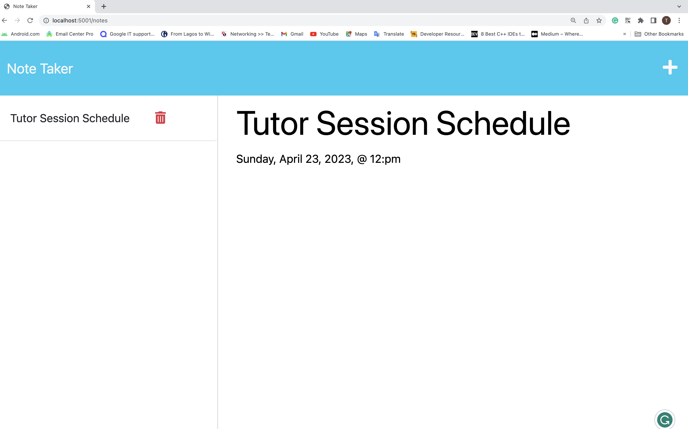
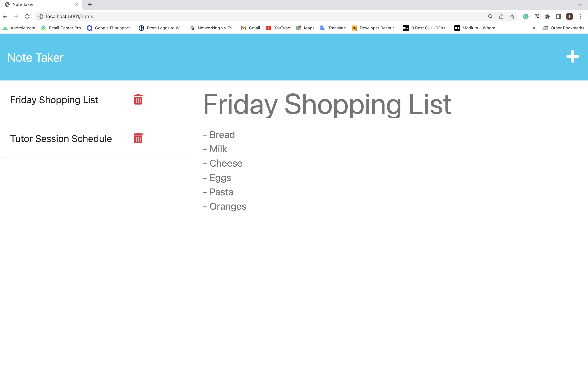
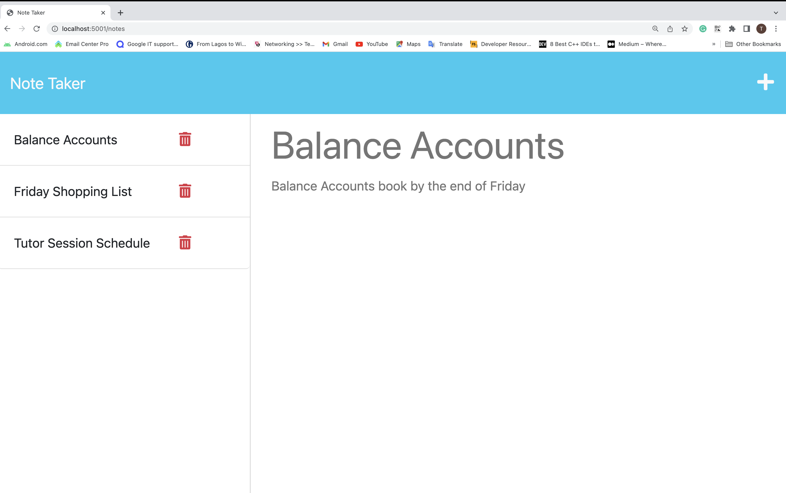
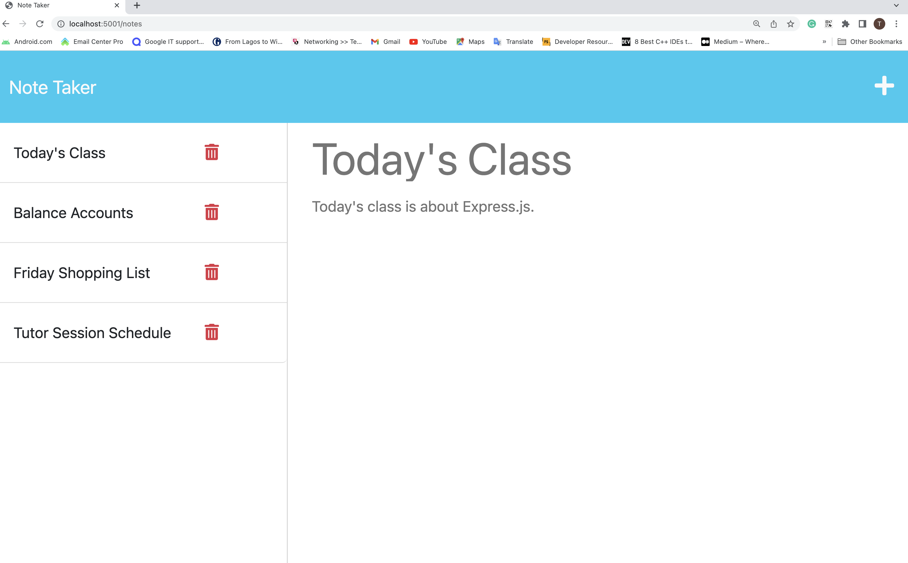
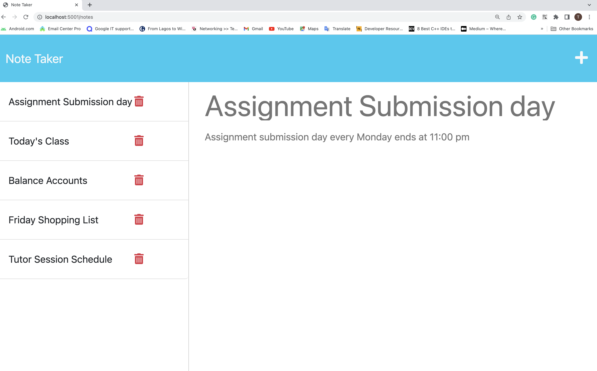
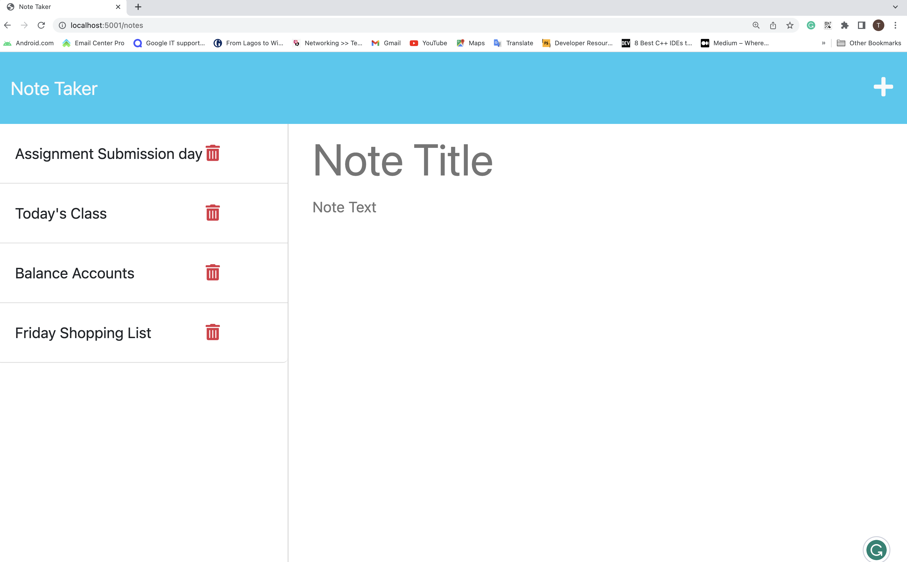
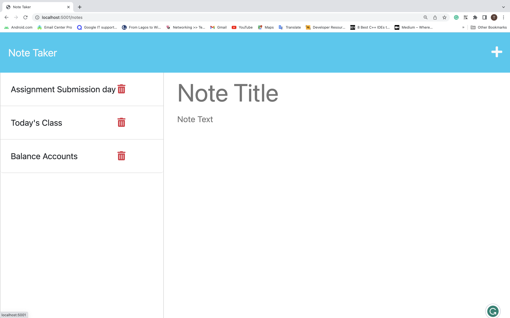
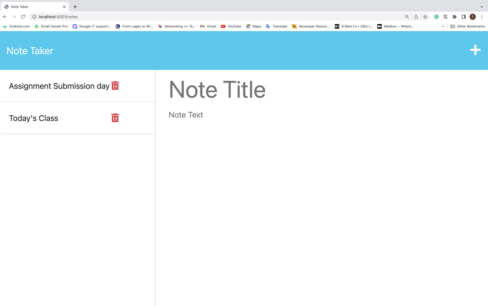
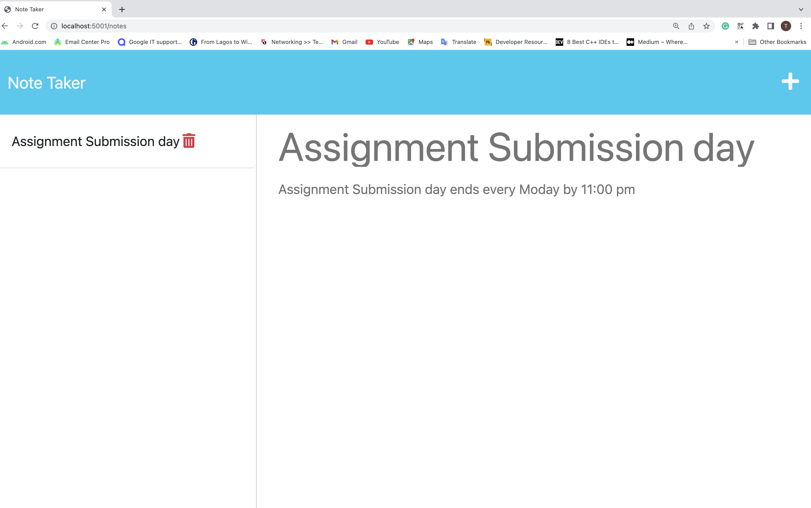
